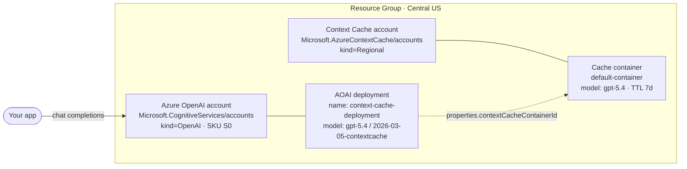

# Azure Context Cache — One-Click Quickstart

Provision an end-to-end Azure Context Cache (Prompt Cache) setup — **Azure OpenAI account + Context Cache account & container + an AOAI deployment that is linked to the cache container** — from a single ARM template, with sensible defaults preconfigured for the **Central US** launch region.

---

## Deploy

[](https://portal.azure.com/#create/Microsoft.Template/uri/https%3A%2F%2Fraw.githubusercontent.com%2Fkraman-msft-eng%2FAzureContextCache%2Fmain%2Fazuredeploy.json)

Pick a subscription + resource group, click **Create**. That's it.

> One-time, per subscription: register the preview features (the deploy will fail with `FeatureNotRegistered` otherwise):
>
> ```bash
> az provider register --namespace Microsoft.AzureContextCache
> az feature  register --namespace Microsoft.AzureContextCache --name EnablePreview
> az feature  register --namespace Microsoft.CognitiveServices --name OpenAI.ContextCacheAllowed
> ```
> Both `EnablePreview` and `OpenAI.ContextCacheAllowed` are gated — email **azurecontextcacherp@microsoft.com** if they stay `Pending`. Or run `./scripts/register-providers.ps1`.

---

## What you get



A single ARM deployment creates all four resources, with the AOAI deployment's `properties.contextCacheContainerId` already pointing at the new cache container — no extra wiring needed.

| # | Resource | Type | API |
|---|---|---|---|
| 1 | Azure OpenAI account | `Microsoft.CognitiveServices/accounts` (kind `OpenAI`, SKU `S0`) | `2024-10-01` |
| 2 | Context Cache account | `Microsoft.AzureContextCache/accounts` (`Regional`) | `2026-01-01-preview` |
| 3 | Cache container | `Microsoft.AzureContextCache/accounts/containers` (model `gpt-5.4`, TTL 7d) | `2026-01-01-preview` |
| 4 | AOAI deployment linked to (3) | `Microsoft.CognitiveServices/accounts/deployments` (SKU `Standard`/100) | `2026-03-15-preview` |

---

## Defaults

| Setting | Value |
|---|---|
| Region | `centralus` |
| Name prefix | auto-generated `cc<hash>` |
| AOAI account name | `<prefix>-aoai` |
| Cache account name | `<prefix>-cache` |
| Cache container name | `default-container` |
| AOAI deployment name | `context-cache-deployment` |
| Model | `gpt-5.4`, version `2026-03-05-contextcache` |
| SKU | `Standard`, capacity `100` |
| TTL | `7` days |

The only two template parameters are `location` (default `centralus`) and `namePrefix` (auto-generated).

---

## CLI alternative

```powershell
./scripts/deploy.ps1 -ResourceGroup rg-cc-demo
# or
az deployment group create -g rg-cc-demo --template-file ./azuredeploy.json
```

Use the Bicep equivalent at [bicep/main.bicep](bicep/main.bicep) if you prefer.

---

## Repository layout

```
.
├── azuredeploy.json            # Single all-in-one ARM template (button target)
├── azuredeploy.parameters.json
├── bicep/main.bicep            # Bicep equivalent
├── bicep/main.bicepparam
├── scripts/
│   ├── register-providers.ps1
│   └── deploy.ps1
└── .github/workflows/validate.yml
```

---

## Troubleshooting

| Symptom | Fix |
|---|---|
| `FeatureNotRegistered` | Run the three `az feature register` commands above; wait until status is `Registered`. Email azurecontextcacherp@microsoft.com if a feature stays `Pending`. |
| `LocationNotAvailableForResourceType` | Only `centralus` (launch) and `swedencentral` are supported. |
| `InvalidResourceName` | `namePrefix` must be 3-12 lowercase letters/digits. |
| AOAI deployment ignores cache | The cache container and AOAI account must be in the same region — this template pins both to `location`. |
